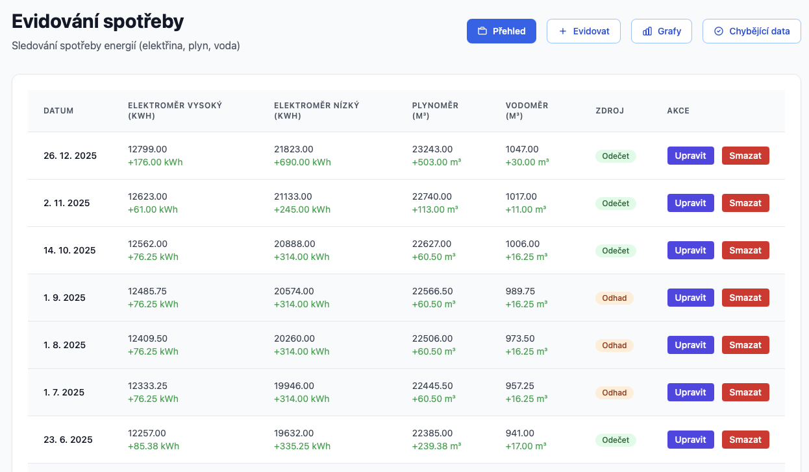

# Evidování spotřeby energií

Moderní webová aplikace pro sledování a evidenci spotřeby energií (elektřina, plyn, voda). Aplikace umožňuje uživatelům zaznamenávat stav měřičů, zobrazovat historická data v tabulce a grafech, a automaticky doplňovat chybějící záznamy.



## 📋 Popis

Aplikace "Evidování spotřeby energií" je moderní webová aplikace postavená na Python FastAPI frameworku, která slouží pro evidenci a sledování spotřeby energií v domácnosti nebo podniku. Uživatelé mohou zaznamenávat stavy měřičů (elektroměr vysoký/nízký tarif, plynoměr, vodoměr), prohlížet historická data v přehledné tabulce a interaktivních grafech, a automaticky doplňovat chybějící záznamy pomocí inteligentní interpolace.

Aplikace je určena pro všechny, kteří chtějí systematicky sledovat svou spotřebu energií a mít přehled o vývoji spotřeby v čase. Hlavní charakteristiky aplikace zahrnují moderní uživatelské rozhraní s boxovým designem, responzivní layout, bezpečnou práci s databází a automatické doplňování chybějících dat.

## ✨ Funkce

- ✅ **Evidování spotřeby** - Zaznamenávání stavů měřičů (elektroměr vysoký/nízký tarif, plynoměr, vodoměr) s validací dat
- ✅ **Přehledná tabulka** - Zobrazení posledních záznamů s výpočtem rozdílů mezi měřeními
- ✅ **Interaktivní grafy** - Chart.js grafy pro vizualizaci spotřeby v čase s rozlišením zdrojů dat
- ✅ **Automatické doplnění** - Návrhy pro měsíce bez odečtu, stavy měřičů lineární interpolací podle skutečného odstupu dnů
- ✅ **CRUD operace** - Kompletní správa záznamů (vytvoření, editace, mazání)
- ✅ **Výměna měřiče** - Označení v editaci záznamu; skok stavu se pak nepočítá jako spotřeba v tabulce, grafech ani meziročním porovnání
- ✅ **Filtrování dat** - Checkbox „Zobrazit pouze odečty“ v přehledu skryje automaticky doplněné odhady

## 📖 Použití

Aplikace poskytuje jednoduché a intuitivní rozhraní pro evidenci spotřeby energií. Po spuštění aplikace můžete začít zaznamenávat stavy měřičů a sledovat vývoj spotřeby v čase.

### Základní workflow

1. **Přidání záznamu**: Na hlavní stránce klikněte na tlačítko "Přidat záznam" a vyplňte formulář se stavy měřičů a datem měření. Poslední odečet je v polích jen jako placeholder (nápověda), takže se nedá omylem uložit stará hodnota
2. **Prohlížení dat**: Na hlavní stránce si můžete prohlédnout posledních 12 záznamů v tabulce s automatickým výpočtem rozdílů
3. **Grafické zobrazení**: Přepněte na záložku "Grafy" pro vizualizaci spotřeby pomocí interaktivních grafů
4. **Automatické doplnění**: Pokud některý kalendářní měsíc nemá odečet, můžete použít funkci "Chybějící data" pro automatické generování návrhů

## 🚀 Deployment

### Předpoklady

- Docker a Docker Compose
- Externí MySQL/MariaDB databáze

### Docker Compose

Aplikace je připravena pro spuštění pomocí Docker Compose. Soubor `docker-compose.yml` obsahuje veškerou potřebnou konfiguraci.

#### Spuštění

```bash
docker compose up -d --build
```

Aplikace bude dostupná na `http://localhost:8000` (port 8000 je mapován na port 8000 v kontejneru).

#### Konfigurace

Aplikace je konfigurována pomocí `.env` souboru a `docker-compose.yml`:

**Environment variables (.env soubor):**

Vytvořte soubor `.env` v kořenovém adresáři projektu (můžete použít `.env.example` jako šablonu).

**docker-compose.yml:**

```yaml
services:
  spotreba:
    build: .
    container_name: spotreba-energii
    hostname: spotreba-energii
    restart: unless-stopped
    environment:
      - DB_HOST=${DB_HOST}
      - DB_PORT=${DB_PORT}
      - DB_DATABASE=${DB_DATABASE}
      - DB_USER=${DB_USER}
      - DB_PASSWORD=${DB_PASSWORD}
    networks:
      - proxy_network
    ports:
      - "8000:8000"

networks:
  proxy_network:
    external: true
```

**Důležité:** Soubor `.env` obsahuje citlivé údaje a je v `.gitignore`, takže se nebude commitovat na GitHub. Pro ostatní vývojáře je k dispozici `.env.example` jako šablona.

#### Update aplikace

```bash
docker compose pull
docker compose up -d
```

#### Rollback na konkrétní verzi

V `docker-compose.yml` změňte image tag:

```yaml
services:
  spotreba:
    image: ghcr.io/elvisek2020/web-evidence_spotreby_energii:latest
```

### GitHub a CI/CD

#### Inicializace repozitáře

1. **Vytvoření GitHub repozitáře**:

   ```bash
   # Vytvořte nový repozitář na GitHubu
   # Název: web-evidence_spotreby_energii
   ```
2. **Inicializace lokálního repozitáře**:

   ```bash
   git init
   git add .
   git commit -m "Initial commit"
   git branch -M main
   git remote add origin https://github.com/elvisek2020/web-evidence_spotreby_energii.git
   git push -u origin main
   ```
3. **Vytvoření GitHub Actions workflow**:

   Vytvořte soubor `.github/workflows/docker.yml` s workflow pro automatické buildy Docker image. Příklad workflow najdete v dokumentaci GitHub Actions nebo v existujících projektech.
4. **Nastavení viditelnosti image**:

   - Po prvním buildu jděte na GitHub → Packages
   - Najděte vytvořený package `web-evidence_spotreby_energii`
   - V Settings → Change visibility nastavte na **Public**

#### Commitování změn a automatické buildy

1. **Proveďte změny v kódu**
2. **Commit a push**:

   ```bash
   git add .
   git commit -m "Popis změn"
   git push origin main
   ```
3. **Automatický build**:

   - Po push do `main` branch se automaticky spustí GitHub Actions workflow
   - Vytvoří se Docker image pro `linux/amd64` a `linux/arm64`
   - Image se nahraje do GHCR
   - Taguje se jako `latest` a `sha-<commit-sha>`
4. **Sledování buildu**:

   - GitHub → Actions → zobrazí se běžící workflow
   - Po dokončení je image dostupná na `ghcr.io/elvisek2020/web-evidence_spotreby_energii:latest`

#### GitHub Container Registry (GHCR)

Aplikace je dostupná jako Docker image z GitHub Container Registry:

- **Latest**: `ghcr.io/elvisek2020/web-evidence_spotreby_energii:latest`
- **Konkrétní commit**: `ghcr.io/elvisek2020/web-evidence_spotreby_energii:sha-<commit-sha>`

Image je **veřejný** (public), takže není potřeba autentizace pro pull.

---

## 🔧 Technická dokumentace

### 🏗️ Architektura

Aplikace je postavena jako moderní webová aplikace s oddělením backendu a frontendu:

- **Backend**: Python FastAPI framework s REST API endpointy
- **Frontend**: Server-side rendering pomocí Jinja2 templates s Alpine.js pro interaktivitu
- **Databáze**: Externí MySQL/MariaDB databáze s SQLAlchemy ORM
- **Styling**: Tailwind CSS s boxovým design systémem
- **Grafy**: Chart.js pro interaktivní vizualizaci dat

**Databázová struktura:**

- **Databáze**: `spotreba-data` (externí)
- **Tabulka**: `spotreba`
- **Sloupce**:
  - `id` - Primární klíč
  - `datum` - Datum měření (formát YYYY-MM-DD)
  - `elektromer_vysoky` - Stav elektroměru vysoký tarif (kWh)
  - `elektromer_nizky` - Stav elektroměru nízký tarif (kWh)
  - `plynomer` - Stav plynoměru (m³)
  - `vodomer` - Stav vodoměru (m³)
  - `fve` - Stav počítadla výroby FVE na střídači (kWh, kumulativní jako ostatní měřiče; 0 = neevidováno)
  - `source` - Zdroj dat (boolean: false = manuální, true = automaticky doplněné)
  - `vymena_elektromer_vysoky`, `vymena_elektromer_nizky`, `vymena_plynomer`, `vymena_vodomer`, `vymena_fve` - Příznak výměny měřiče u daného odečtu (boolean)

Chybějící sloupce se doplní automaticky při startu aplikace (`ensure_schema` v `app/main.py`), migrace se nespouští ručně.

### Technický stack

**Backend:**

- FastAPI (Python 3.11+)
- SQLAlchemy ORM pro práci s databází
- Pydantic pro validaci dat a serializaci
- Uvicorn jako ASGI server
- PyMySQL jako MySQL driver

**Frontend:**

- Jinja2 template engine pro server-side rendering
- Alpine.js pro reaktivní JavaScript
- Tailwind CSS pro styling
- Chart.js pro interaktivní grafy
- HTML5 + CSS3

**Deployment:**

- Docker
- Docker Compose

### 📁 Struktura projektu

```
web-evidence_spotreby_energii/
├── app/
│   ├── main.py              # FastAPI aplikace
│   ├── database.py          # Databázové připojení
│   ├── models.py            # SQLAlchemy modely
│   ├── schemas.py           # Pydantic schémata
│   ├── routers/             # API endpointy
│   │   ├── spotreba.py      # CRUD operace pro spotřebu
│   │   ├── grafy.py         # API pro grafy
│   │   └── missing_data.py  # Automatické doplnění dat
│   ├── templates/           # Jinja2 šablony
│   │   ├── base.html        # Základní template
│   │   ├── index.html       # Hlavní stránka
│   │   ├── evidovat.html    # Přidávání záznamů
│   │   ├── edit.html        # Editace záznamů
│   │   ├── grafy.html       # Grafické zobrazení
│   │   └── missing_data.html # Chybějící data
│   └── static/              # Statické soubory
│       ├── css/
│       │   └── style.css    # Custom CSS s Tailwind
│       └── js/
│           └── app.js       # Hlavní JavaScript
├── requirements.txt         # Python závislosti
├── Dockerfile               # Docker image definice
├── docker-compose.yml       # Docker Compose konfigurace
├── .env                     # Environment variables (není v git)
├── .env.example             # Šablona pro environment variables
├── .gitignore               # Git ignore soubor
└── README.md                # Tato dokumentace
```

### 🔧 API dokumentace

Aplikace poskytuje REST API endpointy pro správu dat:

**Hlavní endpointy (HTML stránky):**

- `GET /` - Hlavní stránka s přehledem záznamů
- `GET /evidovat` - Stránka pro přidávání záznamů
- `GET /edit/{id}` - Stránka pro editaci záznamu
- `GET /grafy` - Stránka s grafy
- `GET /missing-data` - Stránka s chybějícími daty

**API endpointy (JSON):**

- `GET /api/spotreba` - Seznam záznamů (query parametry: `limit`, `manual_only`)
- `POST /api/spotreba` - Vytvoření záznamu
- `PUT /api/spotreba/{id}` - Aktualizace záznamu
- `DELETE /api/spotreba/{id}` - Smazání záznamu
- `GET /api/grafy/data` - Kumulativní stavy měřičů (query parametr `period`)
- `GET /api/grafy/monthly-diff` - Měsíční spotřeba jako přírůstky (query parametr `period`)
- `GET /api/grafy/yoy` - Meziroční porovnání spotřeby (roky vzestupně)
- `GET /api/missing-data/suggestions` - Návrhy chybějících dat (nejnovější první)

Parametr `period` u grafů přijímá hodnoty `3months`, `6months`, `year`, `2years`, `3years` a `all` (výchozí).

### 💻 Vývoj

#### Přidání nových funkcí

1. **Backend změny**:

   - API endpointy: `app/routers/`
   - Databázové modely: `app/models.py`
   - Business logika: `app/routers/` (v jednotlivých routerech)
   - Databázové připojení: `app/database.py`
2. **Frontend změny**:

   - UI logika: `app/static/js/app.js`
   - HTML struktura: `app/templates/`
   - Styly: `app/static/css/style.css` (používejte box-style komponenty a Tailwind CSS)

#### Testování

- **Lokální testování**: Spusťte aplikaci pomocí `docker compose up -d --build` a otestujte všechny funkce
- **API testování**: Použijte nástroje jako Postman nebo curl pro testování REST API endpointů
- **Formulářová validace**: Otestujte všechny formuláře s různými vstupy (validní i nevalidní)

#### Debugging

- Nastavte `LOG_LEVEL=DEBUG` v `.env` souboru pro detailní logy (pokud je podporováno)
- Server loguje všechny důležité události s timestampy
- Frontend loguje chyby do konzole prohlížeče
- Použijte Docker logs: `docker compose logs -f`

### 🎨 UI/UX

Aplikace používá **box-style komponenty** pro konzistentní vzhled:

- **Konzistentní mezery**: Tailwind spacing scale (4px, 8px, 12px, 16px, 24px, 32px)
- **Boxový design**: Bílé karty s stíny a zaoblenými rohy
- **Tlačítka místo tabů**: Konzistentní navigace pomocí tlačítek
- **Pattern "App Name - Tab Name"**: "Evidování spotřeby - Přehled"
- **Responzivní design**: Desktop-first s deklarativní responzivitou
- **Přístupnost (A11y)**: Focus-visible, ARIA atributy, keyboard navigation, WCAG AA standardy

**Komponentní třídy:**

```css
.btn - Základní tlačítko
.btn-primary - Modré primární tlačítko
.btn-secondary - Šedé sekundární tlačítko
.btn-outline - Bílé tlačítko s modrým ohraničením
.input - Formulářové pole
.card - Hlavní box (bílý s stínem)
```

### 🔒 Bezpečnost

- **Prepared statements**: Ochrana proti SQL injection pomocí SQLAlchemy ORM
- **Validace dat**: Pydantic schémata pro typovou validaci na úrovni API
- **XSS ochrana**: Jinja2 autoescaping pro automatické escapování HTML
- **Environment variables**: Citlivé údaje v `.env` souboru (není v git)

### 🐛 Známé problémy

V současné době nejsou známé žádné kritické problémy.

### 📚 Další zdroje

- [FastAPI dokumentace](https://fastapi.tiangolo.com/)
- [SQLAlchemy dokumentace](https://docs.sqlalchemy.org/)
- [Tailwind CSS dokumentace](https://tailwindcss.com/docs)
- [Chart.js dokumentace](https://www.chartjs.org/docs/)
- [Docker dokumentace](https://docs.docker.com/)
- [GitHub Actions dokumentace](https://docs.github.com/en/actions)

## 📄 Licence

Tento projekt je vytvořen pro vzdělávací účely.
