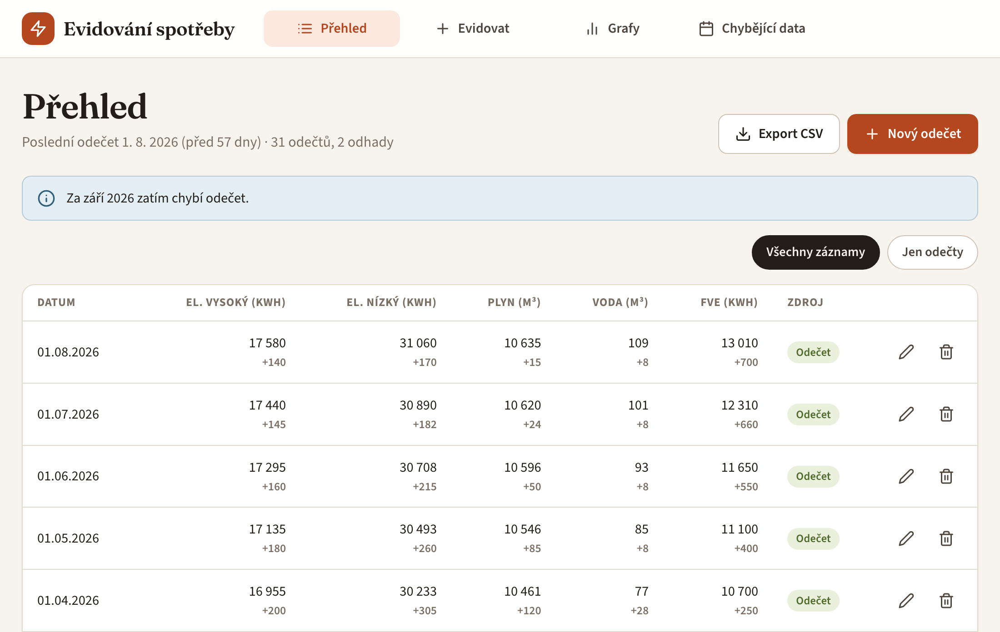

# Evidování spotřeby energií

Webová aplikace pro evidenci stavů měřičů energií (elektřina ve vysokém a nízkém tarifu, plyn, voda) a počítadla výroby FVE. Zobrazuje historii v tabulce s rozdíly, měsíční spotřebu a meziroční porovnání v grafech a doplňuje odhady pro měsíce bez odečtu.

Produkce: **https://spotreba.elvisek.cz**



## 📋 Popis

Aplikace je postavená na Python FastAPI se serverovým vykreslováním šablon Jinja2 a externí databází MySQL/MariaDB. Uživatel zapisuje ruční odečty měřičů, aplikace z nich počítá spotřebu po měsících a letech, hlídá návaznost odečtů (překlep, výměna měřiče) a pro kalendářní měsíce bez odečtu navrhuje odhady, které udržuje v souladu s okolními odečty.

Aplikace je určená pro domácnost, která chce mít přehled o vývoji spotřeby a výroby energie v čase.

## ✨ Funkce

- ✅ **Evidování odečtů** – stavy elektroměru (VT/NT), plynoměru, vodoměru a počítadla FVE s validací; výchozí datum je dnešek a pole jsou předvyplněná stavy posledního ručního odečtu, takže stačí přepsat, co se změnilo
- ✅ **Kontrola návaznosti** – když je stav nižší než předchozí ruční odečet (nebo vyšší než následující), formulář se vrátí s varováním; pokles jde rovnou uložit jako výměnu měřiče
- ✅ **Přehled** – tabulka s rozdílem oproti předchozímu záznamu (i na konci stránky), stránkování po 15 záznamech, filtr „Jen odečty“, počty odečtů a odhadů, upozornění na chybějící odečet v aktuálním měsíci a export do CSV
- ✅ **Výměna měřiče** – příznak u jednotlivých měřičů; skok stavu se nepočítá jako spotřeba v tabulce, grafech ani meziročním porovnání
- ✅ **Měsíční spotřeba** – rozpočet do kalendářních měsíců podle dní mezi ručními odečty; samostatné grafy pro elektřinu a FVE (kWh), plyn a vodu (m³), každý s jednou osou, odlišení dopočtených měsíců a tabulka hodnot
- ✅ **Stavy měřičů** – průběh stavů měřičů u všech záznamů, odhady jako duté body
- ✅ **Meziroční porovnání** – spotřeba po kalendářních letech ve sbalitelné kartě pod grafy (výchozí sbalená); rozpracovaný rok se srovnává se stejným obdobím loňska, u FVE je vyšší výroba „lepší“
- ✅ **Chybějící data** – návrhy odhadů pro měsíce bez odečtu, přehled mezer, které automaticky doplnit nejde, a kontrola uložených odhadů s hromadným přepočtem
- ✅ **Automatický přepočet odhadů** – po přidání, opravě nebo smazání ručního odečtu se odhady v jeho okolí dopočítají znovu
- ✅ **Jednotný vzhled** – design systém `app.css` (standard web-app-ui, paleta Personal): stejná tlačítka, karty a formuláře na všech stránkách, přepínač motivu Systém / Světlý / Tmavý a široké stránky v zápatí, na mobilu spodní lišta menu a seznam místo tabulky

## 📖 Použití

### Základní workflow

1. **Nový odečet** – v záložce „Evidovat“ jsou pole předvyplněná posledním ručním odečtem; zkontrolujte datum, přepište stavy, které se změnily (FVE neevidujete = 0), a uložte tlačítkem nebo Ctrl+S / ⌘S. Když stav nenavazuje na okolní ruční odečty, formulář se vrátí s varováním a volbami *Uložit přesto* a *Uložit jako výměnu měřiče* – nebo hodnoty opravte a uložte znovu.
2. **Přehled** – na hlavní stránce jsou záznamy od nejnovějšího s rozdíly. Filtr „Jen odečty“ skryje odhady a u rozdílu ukáže délku intervalu. Tlačítkem „Export CSV“ stáhnete všechny záznamy pro Excel.
3. **Oprava a výměna měřiče** – v editaci záznamu opravíte hodnoty nebo označíte měřič, který byl u odečtu vyměněn (příznak patří na první odečet nového měřiče).
4. **Grafy** – měsíční spotřeba nebo stavy měřičů za zvolené období, pod nimi sbalitelná tabulka hodnot a meziroční porovnání.
5. **Chybějící data** – vytvořte odhady pro měsíce bez odečtu a zkontrolujte, že uložené odhady odpovídají odečtům.

## 🧮 Jak aplikace počítá

Výpočty jsou v jednom modulu `app/services/vypocty.py` (čisté funkce pokryté testy):

- **Ruční odečty vs. odhady** – statistiky (měsíce, roky, anomálie) vycházejí jen z ručních odečtů. Uložené odhady (`source = true`) se projeví jen v přehledu (stav a rozdíl u řádku s odhadem) a v exportu CSV, z výpočtů přebírají jen příznak výměny měřiče. Zastaralý odhad tak grafy ani meziroční porovnání nezkreslí.
- **Rozpočet podle dní** – spotřeba mezi dvěma ručními odečty se rozloží rovnoměrně na dny intervalu `[od, do)` a sečte do kalendářních měsíců a let. Interval 1. 12. → 1. 1. tak patří do prosince.
- **Úplné měsíce** – v měsíčním grafu je hodnota jen u měsíce, který je pro daný měřič pokrytý celý. Probíhající měsíc se ukáže až po dalším odečtu, období grafu (3 měsíce až 3 roky) se počítá v úplných měsících.
- **Dopočtené měsíce** – měsíc spočtený z intervalu, ve kterém leží celý kalendářní měsíc bez ručního odečtu, je označený jako dopočtený: v grafu světlejší sloupec, v tabulce hodnot i v meziročním porovnání „≈“. Při řídkých odečtech je takových měsíců většina (viz Známá omezení).
- **Výměna měřiče** – interval končící odečtem s příznakem výměny není spotřeba. Měsíc, do kterého zasahuje, je u daného měřiče prázdný, a rok s výměnou nejde meziročně srovnat.
- **FVE** – počítadlo je kumulativní; hodnota 0 znamená „neevidováno“. Ve statistikách se nula přemostí k další nenulové hodnotě, v tabulce rozdíl zůstane prázdný.
- **Anomálie** – pokles stavu mezi ručními odečty bez příznaku výměny se ze součtů nevyhazuje (překlep se vyruší s dalším nafouknutým intervalem). Před uložením na pokles upozorní kontrola návaznosti, v přehledu je záporný rozdíl červeně a JSON API grafů ho vrací v poli `anomalie`.
- **Meziroční porovnání** – rok Y se srovnává se stejným obdobím roku Y−1 (u rozpracovaného roku do stejného dne; 29. 2. se posune na 1. 3.). Srovnání se ukáže jen tehdy, když má měřič pokrytá obě období celá.
- **Odhady chybějících měsíců** – návrh se zakládá k 1. dni měsíce bez odečtu, hodnoty jsou lineární odhad podle dní mezi okolními ručními odečty. Mezeru s výměnou měřiče (nebo bez navazujícího ručního odečtu) aplikace přeskočí a vypíše s důvodem.
- **Přepočet odhadů** – po změně ručního odečtu se v jedné transakci přepočítají odhady mezi předchozím a následujícím ručním odečtem. Úprava samotného odhadu přepočet nespouští; při další změně okolních odečtů se ale přepíše. Starší nesrovnalosti ukáže a po potvrzení opraví „Kontrola uložených odhadů“ na stránce Chybějící data – typicky odhady z verzí před 31. 8. 2026, které dělily mezeru rovnoměrně podle pořadí měsíce, ne podle dní.

Kromě unit testů jsou výpočty ověřené nezávislým přepočtem nad exportem reálných dat jiným postupem (rozklad spotřeby do jednotlivých dní): měsíce, roční součty, meziroční srovnání i rozdíly v přehledu vyšly bez jediného rozdílu.

## 🚀 Deployment

### Předpoklady

- Docker a Docker Compose
- Externí MySQL/MariaDB databáze
- Síť `proxy_network` pro reverse proxy (v produkci openresty)

### Docker Compose

```bash
docker compose up -d --build
```

Aplikace poběží na `http://localhost:8080` (port 8080 na hostu → 8000 v kontejneru). Kontejner běží pod uživatelem `appuser` (UID 1000), má healthcheck na `/health` a časovou zónu `Europe/Prague`.

Místo lokálního buildu lze v `docker-compose.yml` použít hotový image z GHCR – zakomentujte `build` a odkomentujte `image: ghcr.io/elvisek2020/web-evidence_spotreby_energii:latest`.

### Konfigurace

Proměnné prostředí se čtou ze souboru `.env` (šablona je v `.env.example`, `.env` se necommituje a do image se nedostane díky `.dockerignore`):

| Proměnná | Povinná | Výchozí | Popis |
|----------|---------|---------|-------|
| `DB_HOST`, `DB_PORT`, `DB_DATABASE`, `DB_USER`, `DB_PASSWORD` | ano | – | Připojení k MySQL/MariaDB |
| `TZ` | ne | `Europe/Prague` | Časová zóna – určuje „dnešní“ datum pro validaci odečtů |
| `LOG_LEVEL` | ne | `INFO` | Úroveň logování (`DEBUG`, `INFO`, `WARNING`, …) |
| `ALLOWED_ORIGINS` | ne | prázdné | Čárkou oddělené originy pro CORS; prázdné = CORS vypnutý |

### Databáze a migrace

Schéma se upravuje automaticky při startu aplikace (`app/migrations.py`), ručně se nic nespouští:

1. **Nová instalace** – tabulka `spotreba` vznikne z modelu (sloupce `DOUBLE`, unikátní index na `datum`).
2. **Starší instalace** – doplní se chybějící sloupce (`fve`, `vymena_*`).
3. **Unikátní index na `datum`** – přidá se, jen když v tabulce nejsou duplicitní data. Jinak se do logu zapíše ERROR se seznamem duplicit a index se doplní při dalším startu po jejich odstranění.

### Update aplikace

```bash
docker compose pull      # při použití image z GHCR
docker compose up -d --build
```

Před vydáním zvyšte verzi v `app/static/version.json`. Aplikace ji čte při startu, zobrazuje v zápatí a přidává k adresám CSS a JS (`?v=`), takže prohlížeče po nasazení načtou nové soubory.

### Rollback na konkrétní verzi

V `docker-compose.yml` nastavte konkrétní tag image, např. `ghcr.io/elvisek2020/web-evidence_spotreby_energii:sha-<commit-sha>`.

### GitHub a CI/CD

Po pushi do větve `main` spustí GitHub Actions (`.github/workflows/docker.yml`):

1. **test** – unit testy (`pytest`) v kontejneru `python:3.13-slim`,
2. **build** – jen po úspěšných testech sestaví image pro `linux/amd64` a `linux/arm64` a nahraje ho do GHCR s tagy `latest`, `main` a `sha-<commit-sha>`.

Image je veřejný: `ghcr.io/elvisek2020/web-evidence_spotreby_energii`.

---

## 🔧 Technická dokumentace

### 🏗️ Architektura

- **Backend** – FastAPI; HTML stránky a jejich formuláře v `routers/pages.py`, JSON API v `routers/spotreba.py`, `grafy.py` a `missing_data.py`. Routery jsou tenké vrstvy nad službami.
- **Formuláře** – klasické odeslání bez JavaScriptu: POST → přesměrování → GET. Výsledek akce nese adresa jako kód (`?ok=ulozeno&prepocteno=2`) a stránka ho vypíše jako alert; chyby validace a varování kontroly návaznosti vrátí formulář s vyplněnými hodnotami.
- **Služby** – `services/vypocty.py` obsahuje čisté výpočty bez DB, `services/zaznamy.py` operace nad databází (vytvoření, úprava a smazání záznamu s přepočtem odhadů v jedné transakci), `services/grafy.py` data grafů pro API i stránku.
- **Měřiče** – jediná definice v `app/meters.py` (`METERS`: klíč, popisek, jednotka, slot barvy řady, graf, chování FVE). Šablony, grafy i výpočty je procházejí v cyklu.
- **Frontend** – serverové vykreslení Jinja2, design systém `static/css/app.css` podle standardu web-app-ui, `static/js/app.js` podle standardu web-app-interactions (potvrzení `data-confirm`, motiv, šířka stránky) a `static/js/grafy.js` pro Chart.js.
- **Databáze** – externí MySQL/MariaDB přes SQLAlchemy ORM; schéma spravují migrace při startu.

**Tabulka `spotreba`:**

| Sloupec | Typ | Popis |
|---------|-----|-------|
| `id` | INT | Primární klíč |
| `datum` | DATE, unikátní | Datum odečtu |
| `elektromer_vysoky`, `elektromer_nizky` | DOUBLE | Stav elektroměru VT/NT (kWh) |
| `plynomer`, `vodomer` | DOUBLE | Stav plynoměru a vodoměru (m³) |
| `fve` | DOUBLE, NULL | Kumulativní počítadlo výroby FVE (kWh), 0 = neevidováno |
| `source` | BOOL | `false` = ruční odečet, `true` = automaticky doplněný odhad |
| `vymena_elektromer_vysoky`, `vymena_elektromer_nizky`, `vymena_plynomer`, `vymena_vodomer`, `vymena_fve` | BOOL | U odečtu byl nasazen nový měřič |

Starší instalace mohou mít sloupce měřičů typu `FLOAT` (jednoduchá přesnost); migrace je nemění.

### Technický stack

- **Backend:** Python 3.13, FastAPI 0.141, Starlette 1.7, Pydantic 2.13, SQLAlchemy 2.1, PyMySQL, python-multipart, Uvicorn
- **Frontend:** Jinja2, design systém `app.css` (paleta Personal, písma Fraunces a Source Sans 3 z Google Fonts), vanilla JavaScript, Chart.js 4.5
- **Testy:** pytest
- **Deployment:** Docker, Docker Compose, GitHub Actions, GHCR

### 📁 Struktura projektu

```
web-evidence_spotreby_energii/
├── app/
│   ├── main.py              # FastAPI aplikace, lifespan, chybové stránky, /health
│   ├── database.py          # Připojení k databázi
│   ├── models.py            # SQLAlchemy model Spotreba
│   ├── schemas.py           # Pydantic schémata API
│   ├── meters.py            # Definice měřičů (METERS)
│   ├── migrations.py        # Úpravy schématu při startu
│   ├── templating.py        # Jinja2: verze, globální proměnné, filtry
│   ├── formatovani.py       # České formátování čísel a dat
│   ├── formulare.py         # Převod polí formuláře, hlášky po akci, návratové adresy
│   ├── validace.py          # České hlášky chyb validace
│   ├── services/
│   │   ├── vypocty.py       # Čisté výpočty (rozdíly, měsíce, roky, odhady, kontroly)
│   │   ├── zaznamy.py       # Operace nad DB (uložení, smazání, přepočet odhadů)
│   │   └── grafy.py         # Data grafů a meziročního porovnání
│   ├── routers/
│   │   ├── pages.py         # HTML stránky a formuláře
│   │   ├── spotreba.py      # API záznamů, kontrola návaznosti, CSV export
│   │   ├── grafy.py         # API grafů a meziročního porovnání
│   │   └── missing_data.py  # API návrhů a přepočtu odhadů
│   ├── templates/           # Jinja2 šablony (_icons.html, _macros.html, _formular_odectu.html)
│   └── static/              # css/app.css, js/app.js, js/grafy.js, version.json
├── tests/                   # Unit testy výpočtů a formulářů (bez databáze)
├── scripts/testovaci_data.py  # Naplnění lokální testovací instance
├── docker-compose.yml       # Produkční compose
├── docker-compose.test.yml  # Lokální test: aplikace + MariaDB
├── Dockerfile
├── requirements.txt / requirements-dev.txt
└── README.md
```

### 🔧 API dokumentace

**HTML stránky:**

- `GET /` – přehled (parametry `strana`, `jen_odecty=1`)
- `GET /evidovat`, `POST /evidovat` – nový odečet (pole formuláře, volitelně `potvrzeni=presto|vymena`)
- `GET /edit/{id}`, `POST /edit/{id}` – úprava záznamu
- `POST /smazat/{id}` – smazání (pole `zpet` = návratová adresa v rámci aplikace)
- `GET /grafy` – grafy a meziroční porovnání (parametry `rezim=mesice|stavy`, `obdobi`)
- `GET /missing-data` – chybějící data a kontrola odhadů
- `POST /missing-data/vytvorit` (pole `datum`), `POST /missing-data/vytvorit-vse`, `POST /missing-data/prepocet`

**Záznamy:**

- `GET /api/spotreba` – seznam s rozdíly, nejnovější první (parametry `limit` 1–100, výchozí 12; `offset`; `source_filter` – `false` = jen ruční odečty, `true` = jen odhady)
- `GET /api/spotreba/count` – počet záznamů (parametr `source_filter`)
- `GET /api/spotreba/{id}` – jeden záznam
- `POST /api/spotreba` – nový záznam; odpověď obsahuje `prepocteno_odhadu`
- `PUT /api/spotreba/{id}` – úprava (posílají se jen měněná pole, `null` není povolený)
- `DELETE /api/spotreba/{id}` – smazání; odpověď obsahuje `prepocteno_odhadu`
- `POST /api/spotreba/kontrola` – varování k odečtu před uložením (`{varovani: [{meric, typ, zprava, …}]}`), nic neukládá
- `GET /api/spotreba/export.csv` – všechny záznamy jako CSV (středník, desetinná čárka, UTF-8 s BOM)

**Grafy:**

- `GET /api/grafy/monthly-diff?period=…` – spotřeba po kalendářních měsících
- `GET /api/grafy/data?period=…` – stavy měřičů u jednotlivých záznamů
- `GET /api/grafy/yoy` – roky od nejnovějšího s pokrytím a srovnáním se stejným obdobím loňska
- `GET /api/grafy/summary` – počty záznamů a rozsah dat

Oba grafové endpointy vracejí stejný tvar `{popisky, popisky_dlouhe, rady: {meric: {label, jednotka, hodnoty, odhad, poznamka}}, anomalie}`. `null` v hodnotách přerušuje řadu, důvod je v `poznamka`. Parametr `period` přijímá `3months`, `6months`, `year`, `2years`, `3years` a `all` (výchozí). U měsíčního grafu znamená počet posledních úplných měsíců, u stavů počet dní zpět.

**Chybějící data:**

- `GET /api/missing-data/suggestions` – návrhy odhadů, nejnovější první
- `POST /api/missing-data/create` – vytvoří všechny návrhy
- `POST /api/missing-data/create-single` – vytvoří návrh k danému datu (`{datum}`, hodnoty dopočítá server)
- `GET /api/missing-data/prepocet` – náhled odhadů, které neodpovídají ručním odečtům (změny a konflikty)
- `POST /api/missing-data/prepocet` – přepočítá všechny uložené odhady

**Ostatní:** `GET /health` – stav aplikace a připojení k DB, včetně verze.

Chyby API vracejí `{"detail": "…"}` s českou hláškou, u validace (422) např. `Datum: nesmí být v budoucnosti; Počítadlo FVE: pole je povinné`.

### 💻 Vývoj

**Unit testy** (bez databáze):

```bash
uv run --no-project --python 3.13 --with-requirements requirements-dev.txt pytest -q
```

**Lokální testovací instance** – aplikace s prázdnou MariaDB, bez vazby na produkční databázi:

```bash
docker compose -f docker-compose.test.yml up -d --build
python3 scripts/testovaci_data.py
```

Aplikace poběží na `http://localhost:18080`. Skript `testovaci_data.py` zapisuje jen na localhost a jen do prázdné databáze; data obsahují mezeru bez odečtu, výměnu vodoměru, zahájení evidence FVE, překlep a zastaralý odhad. Úklid:

```bash
docker compose -f docker-compose.test.yml down -v
```

**Přidání měřiče** – doplnit sloupce do `models.py`, `schemas.py` a migrace do `migrations.py`, záznam do `METERS` v `meters.py`. Šablony, grafy a výpočty ho převezmou samy.

**Debugging** – `LOG_LEVEL=DEBUG` v `.env`, logy kontejneru přes `docker compose logs -f`.

### 🎨 UI/UX

Vzhled stojí na design systému **web-app-ui**: `app/static/css/app.css` = paleta `theme_personal.css` + základ `reference_app.css` beze změn + na konci sekce doménových tříd aplikace. V šablonách jsou jen třídy z `app.css`, žádné inline styly ani barvy natvrdo; barvy jdou přes tokeny, takže fungují ve světlém i tmavém motivu.

**Tlačítka – stejná pravidla na všech stránkách:**

| Varianta | Kde |
|----------|-----|
| `btn btn-primary` | jediná hlavní akce stránky nebo karty – Nový odečet, Uložit odečet, Vytvořit všechny návrhy, Přepočítat odhady |
| `btn btn-outline` | vedlejší akce – Export CSV, Vytvořit u návrhu, volby ve varování, stránkování |
| `btn btn-ghost` | zrušení a ikonová tlačítka v řádcích – Zrušit, Upravit, Smazat |
| `btn btn-danger` / `btn-danger-ghost` | potvrzení smazání v modalu / Smazat záznam v editaci |
| `btn btn-secondary` | aktuální stránka ve stránkování |

Velikost: akce stránky a karet mají normální výšku (44 px), akce v řádcích, ve varování a ve stránkování `btn-sm`. Filtry jsou `chip`, přepnutí druhu grafu záložky `tabs`.

Zarovnání: tlačítka a skupiny tlačítek jsou vždy **vpravo** – akce v hlavičce stránky (i po zalomení na mobilu), patičky karet, volby ve varování, filtry i stránkování – a hlavní akce je poslední, úplně vpravo, stejně jako v potvrzovacím modalu (Zrušit · Uložit). Pravidlo je v sekci aplikace v `app.css`, takže platí i pro nová tlačítka. Výjimky: záložky druhu grafu (navigace), prázdné stavy (centrované podle standardu) a přepínač motivu v zápatí.

- Stránka = `.page-header` s `h1.page-title` a sekce v `.card`; titulek okna „Stránka — Evidování spotřeby“.
- Menu: čtyři záložky v hlavičce, na mobilu spodní lišta; aktivní záložku určuje backend (`current_tab`).
- Potvrzení mazání a hromadných akcí přes `data-confirm` na formuláři; výsledek akce jako alert po přesměrování.
- Ikony jsou inline SVG z makra `templates/_icons.html`, opakované části v `templates/_macros.html` (alert, prázdný stav, pole měřiče, stránkování).
- Grafy: každý graf jedna osa a jedna jednotka, barvy řad z validované kategorické palety (tokeny `--color-series-*`), tabulka hodnot jako alternativa ke grafu.
- Přístupnost: popisky polí, `aria-label` u ikonových tlačítek, `aria-current`, viditelný focus, respektování `prefers-reduced-motion`.

### 🔒 Bezpečnost

- **Aplikace nemá přihlášení.** Produkce na `spotreba.elvisek.cz` je záměrně veřejná, a to včetně API pro zápis a mazání záznamů. Kdo zná adresu, může data číst i měnit. Pokud by to přestalo vyhovovat, nabízí se ochrana na reverse proxy (Access List / basic auth) nebo přihlášení podle standardu `web-app-auth`.
- Port 8080 je v `docker-compose.yml` publikovaný na všech rozhraních hostu, aplikace je tedy dostupná i mimo reverse proxy.
- SQL přes SQLAlchemy ORM (parametrizované dotazy), validace vstupů Pydantic schématy, autoescaping Jinja2
- Bezpečnostní hlavičky: `X-Content-Type-Options`, `X-Frame-Options`, `Referrer-Policy`, `Permissions-Policy`
- Kontejner běží pod non-root uživatelem; `.dockerignore` drží `.env` a `.git` mimo image

### 🐛 Známá omezení a plánovaná vylepšení

- Chart.js a písma se načítají z CDN (jsdelivr, Google Fonts); bez internetu se použije systémové písmo a místo grafů hláška – hodnoty zůstávají v tabulce
- Doménové třídy v `app.css` (stránkování přes tlačítka, číselné sloupce, dvousloupcová mřížka grafů, rozbalovací karta) jsou kandidáti na přenos do standardu web-app-ui
- Starší instalace mohou mít sloupce měřičů `FLOAT` s jednoduchou přesností (u stavů nad ~130 000 šum v setinách); případná změna na `DOUBLE` je ruční `ALTER TABLE`
- Ručně upravený odhad se při další změně okolních ručních odečtů přepíše – skutečný odečet je potřeba převést na ruční (v editaci zrušit „Automaticky doplněný odhad“)
- Mezeru s výměnou měřiče je potřeba doplnit ručně, automatický návrh ji přeskočí
- Probíhající měsíc se v měsíčním grafu ukáže až po dalším odečtu
- Předvyplněný stav, který při evidenci nepřepíšete, se uloží beze změny (nulová spotřeba za období) – kontrola návaznosti na to neupozorní
- Při řídkých odečtech je měsíční spotřeba jen rovnoměrný rozpočet dlouhého intervalu: sezónní průběh (topení plynem, výroba FVE) se vyrovná a měsíce jsou označené „≈“. Stejně se podle dní dělí interval přes přelom roku, což ovlivní roční součty i meziroční srovnání. Přesné měsíce dají odečty jednou měsíčně, nejlépe kolem přelomu měsíce.

### 📚 Další zdroje

- [FastAPI dokumentace](https://fastapi.tiangolo.com/)
- [SQLAlchemy dokumentace](https://docs.sqlalchemy.org/)
- [Chart.js dokumentace](https://www.chartjs.org/docs/)
- [Docker dokumentace](https://docs.docker.com/)
- [GitHub Actions dokumentace](https://docs.github.com/en/actions)

## 📄 Licence

Tento projekt je vytvořen pro vzdělávací účely.
